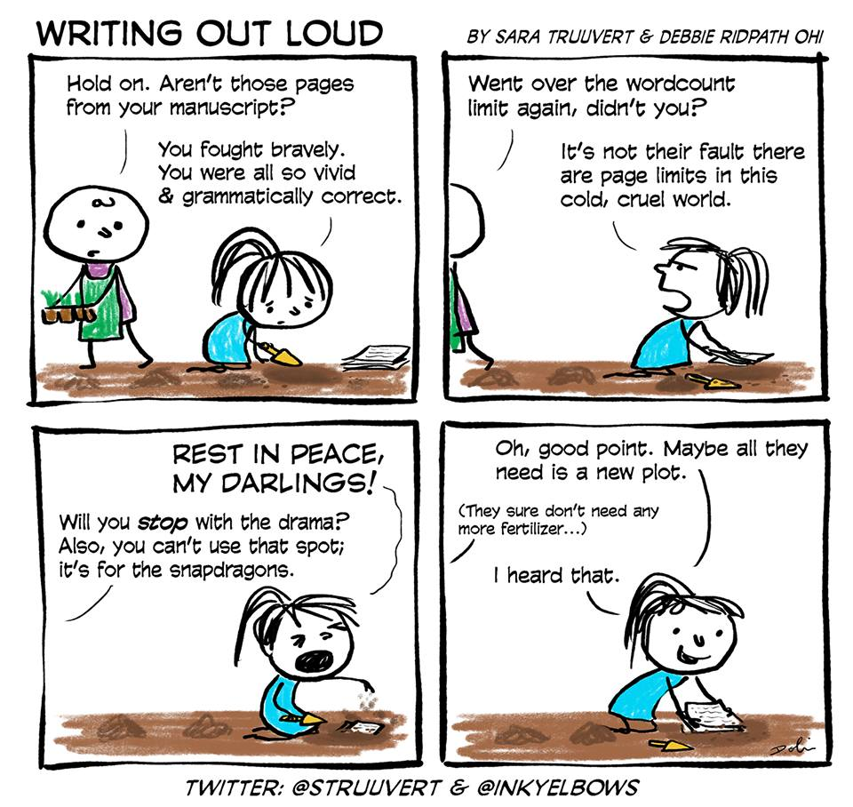

# Word Count with MPI
An MPI implementation of Word Count problem

## Introduzione
Word Count consiste nel determinare in un testo quante occorrenze ci sono di ogni parola presente. Generalmente si presenta in applicazioni in cui è necessario mantenere le parole inserite in limiti definiti (es. nella narrativa, il numero di parole definisce la categoria dello scritto).  

Benchè estremamente semplice nella sua definizione, Word Count rappresenta una sfida nel campo della programmazione distribuita a causa dell'enorme taglia dei problemi che possono presentarsi: pensiamo infatti a situazioni in cui i documenti da esaminare hanno dimensioni arrivani anche a 100 TB, in cui un'esecuzione sequenziale arriva a richiedere mesi se non anni di computazione.  

E' naturale quindi pensare a Word Count come un problema di programmazione distribuita, in cui la distrbuzione dell'input tra i nodi di un cluser può significativamente diminuire il tempo necessario, passando da anni al tempo per un caffè :coffee:

## Soluzione proposta

### Architettura 

## Benchmark

### Architettura di testing

### Esperimenti 

#### Weak Scalability

#### Strong Scalability

### Risultati

## Conclusioni