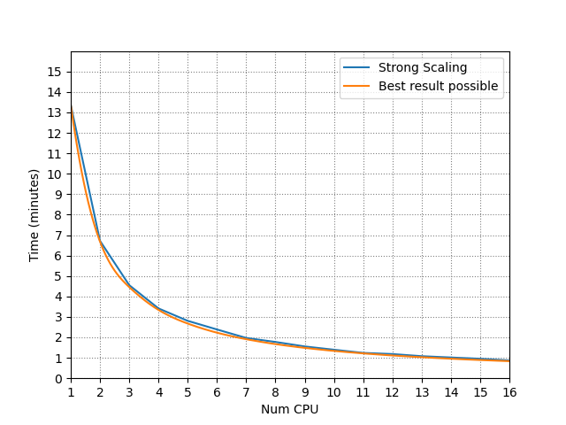
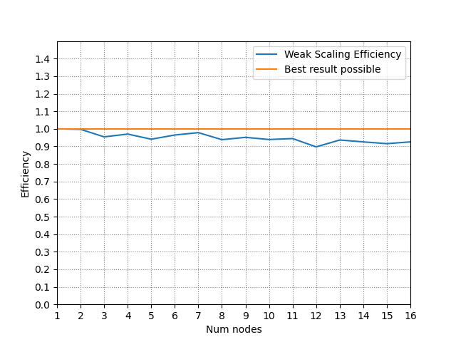

# 1. Introduzione
Word Count consiste nel determinare in un testo quante occorrenze ci sono di ogni parola presente. Generalmente si presenta in applicazioni in cui è necessario mantenere le parole inserite in limiti definiti (es. nella narrativa, il numero di parole definisce la categoria dello scritto).  


Benchè estremamente semplice nella sua definizione, Word Count rappresenta una sfida nel campo della programmazione distribuita a causa dell'enorme taglia dei problemi che possono presentarsi: pensiamo infatti a situazioni in cui i documenti da esaminare hanno dimensioni anche di 100 TB, in cui un'esecuzione sequenziale arriva a richiedere mesi se non anni di computazione.  

E' naturale quindi pensare a Word Count come un problema di programmazione distribuita, in cui la distrbuzione dell'input tra i nodi di un cluser può significativamente diminuire il tempo necessario, passando da anni al tempo per un caffè.


# 2. Soluzione proposta

Viene proposta una soluzione al problema *Word Count* in ambiente distribuito, dove più nodi hanno accesso agli stessi dati. L'input è un insieme di file, e l'output è la lista delle parole contenute nei file associate al numero di loro occorrenze.

La soluzione proposta vuole massimizzare i vantaggi derivanti dalla distribuzione del calcolo e dalla *data locality*, massimizzando il tempo di computazione dei nodi e minimizzando quello di comunicazione. 
Il protocollo di comunicazione utilizzato per la comunicazione e distribuzione del calcolo è Message Passing Interface (MPI) [^0], il quale rappresenta lo standard *de facto* nel campo della comunicazione tra nodi in un cluster, di cui è stata utlizzata l'implementazione OpenMPI [^1]


La soluzione è stata scritta in linguaggio C, e ne viene in seguito presentata e analizzata l'architettura che la compone.

## 2.1. Architettura 

La soluzione segue il paradigma ***Map-Reduce***, in cui la computazione è composta da una fase di *map*, in cui ogni nodo processa una parte dell'input, e da una fase di *reduce*, in cui i risultati dei singoli nodi vengono messi insieme. 

L'input è fornito a tutti i nodi ed è composto da una path in cui sono presenti i file da esaminare.  
**Si assume che tutti i nodi abbiano accesso ai file alla path di input.**  
Il nodo 0 provvederà a dividere il *workload* tra i nodi del cluster ed inviare loro i dati necessari (incluso se stesso), quindi ogni nodo processa la sua porzione di input. I dati vengono raccolti dal nodo 0, che si occuperà di fornirli in output.

La soluzione presentata è pertanto divisibile in 3 fasi:   
1. Partizionamento e distribuzione dell'input ai nodi;  
2. *Word Count* della porzione assegnata (***Map***);   
3. Collezionamento dei risultati (***Reduce***).  

### 2.1.1. Partizionamento e distribuzione dell'input

Questa fase è solo il nodo 0 ad eseguirla, in quanto è propedeutica alla fase di calcolo distribuita.  
Lo scopo di questa fase è quello di definire un partizionamento equilibrato del calcolo tra i vari nodi, al fine di minimizzare i tempi di *idle* derivanti da una distribuzione sbilanciata.  
L'approccio scelto è ***byte level***: ad ogni nodo è assegnata una porzione del file di una taglia fissata di byte, uguale per ogni nodo. Le motivazioni dietro questa scelta sono chiare:
- Distribuzione equa: i nodi processeranno un quantitativo di byte uguale tra loro, uniformando il numero di accessi in lettura ai file in input;
- Disaccoppiamento tra i nodi: ogni nodo riceve un numero di byte da processare ed il file da cui partire, e computa finchè ha da leggere senza interessarsi dello stato degli altri nodi.

Per realizzare tale suddivisione i file vengono astratti come un unico *array di byte*: i file sono ordinati secondo un ordinamento comune a tutti i nodi e vengono considerati consecutivi, cioè ad ogni file segue il primo byte del successivo.


Tale astrazione riduce le informazioni necessarie per iniziare la computazione ed elimina le fasi di sincronizzazioni tra i nodi, permettendo ad ogni nodo di computare indipendentemente.  
Ogni nodo computa a partere da una certa posizione nel vettore, identificata dalla coppia *\<num_files,start_byte\>*, e computa fino ad una certa posizione nel vettore che corrisponde alla posizione di inizio del nodo successivo.

Andiamo ad analizzare alcuni passi critici nell'esecuzione:

Per ogni nodo, il nodo 0 calcola le informazioni necessarie: nella struttura *info* è presenta il numero di byte da leggere, il file di partenza ed il byte di partenza. Il nodo assegna numero di byte da leggere uguale o di 1 unità maggiore a quello degli altri nodi (l'unità in più è necessaria per la gestione delle dimensioni che non dividono il numero di nodi) ed il file a lui assegnato.  

```c
typedef struct info
{
	long int num_file, num_byte,counting;
} info;
```

Per calcolare il file a cui il nodo i-esimo arriva al termine della sua computazione (cioè la posizione nel vettore di file da dare in input al file successivo) viene sommato al byte di partenza del nodo i-esimo (salvato nella variabile **start byte**) il numero di byte da lui letti e gli vengono sottratte le dimensioni del file attuale e successivi fino a che non viene trovato il file di arrivo (in cui **start_byte** è più piccolo della sua dimensione). Se però **start_byte** è esattamente uguale alla dimensione del file corrente, allora significa che il nodo i-esimo legge esattamente fino alla sua fine e pertanto il nodo i+1 inizia a leggere dal file successivo.

```c
for (int i = 0; i < num_proc; i++)
		{
			partitioning[i] = overflow && overflow_value-- > 0 ? total_dim /  
			num_proc + 1 : total_dim / num_proc;
			infos[i].num_file = current_file;
			infos[i].num_byte = start_byte;

			if (i != (num_proc - 1))
			{
				start_byte += partitioning[i];
				for (; current_file < num_files; current_file++)
				{
					if (start_byte <= dimensions[current_file])
					{
						if (start_byte == dimensions[current_file])
						{
							if((current_file + 1) < num_files){
								start_byte = 0;
								current_file++;
						}
						else
							no_more_file = 1;
						}
						break;
					}
					start_byte -= dimensions[current_file];
				}
```
Nota da fare è il flag *no_more_files*: tale parametro gestisce il caso in cui, durante la suddivisione del lavoro, il numero di parole nei file risultasse minore del numero di processori coinvolti nella computazione. Tale situazione, infatti, implica che solo i primi m processori lavoreranno, con m uguale al numero di file totali, mentre i restanti processori non faranno nulla e riceveranno valori tali da non contribuire alla computazione.

A questo punto è necessario calcolare il byte di partenza del nodo i+1: a questo punto **start_byte** si trova all'ultimo byte letto dal nodo i, ma questo potrebbe trovarsi nel mezzo di una parola: ad esempio, data una parola come "abba", potrebbero verificarsi divisioni come "a|bba" o "abb|a".  
L'algoritmo porta **start_byte** alla posizione della prima parola che il nodo i+1 dovrà leggere, che non è altro che la parola successiva a quella tagliata.  
Per farlo saltiamo al byte **start_byte-1** (solo se non partiamo dall'inizio) e consumiamo ogni carattere che non sia un delimitatore di parola. Dato che potremmo terminare il file nel caso in cui la parola tagliata sia l'ultima, tale condizione viene ulteriormente verificata.

```c
				//Need to check if the current byte cuts a word
				sprintf(path, "%s/%s", basepath, files[current_file]->d_name);
				f = fopen(path, "r");

				if(start_byte != 0){
					fseek(f, start_byte - 1, SEEK_SET);
					while (!is_delimeter(c = fgetc(f)))
					{
						start_byte++;
						partitioning[i]++;
					}

					//The cutted word could be the last one
					if (feof(f))
					{
						if((current_file + 1) < num_files){
							start_byte = 0;
							current_file++;
						}
						else
							no_more_file = 1;
					}
				}
			}

			infos[i].counting = partitioning[i];
		}
```

Il lettore potrebbe domandarsi il perchè non sia stato utilizzato un approccio *word level* o *line level*, il quale avrebbe eliminato molta della complessità presente, ed il motivo è presto spiegato ed è figlio della semplicità dell' input a disposizione: entrambi gli approcci, seppur equilibrando al meglio il grado di distribuzione dell'input tra i nodi (ma non gli accessi al file) necessitano di una fase di *pre-processing* iniziale in cui contare il numero di parole o linee presenti nei file non venendo questa fornita in input al problema. Tale fase può essere estremamente lunga per file di dimensioni considerevoli e rappresentare un vero e proprio collo di bottiglia per le prestazioni della soluzione.

### 2.1.2. Word count  

Per il conteggio delle parole si utilizza una struttura **cell** composta da chiave-valore così definita:

```c
typedef struct c_cell{
	char key[30];
	long int value;
} cell;

```
la dimensione *30* deriva dalla lunghezza massima delle parole nell'alfabeto italiano, che è 29 per la parola "*esofagodermatodigiunoplastica*". [^2]

Per la gestione delle parole in memoria è stata utilizzata una **hash map** implementata *ad hoc*, basa sull'algoritmo di hashing FNV su un massimo di 100000 liste.  
Questo valore deriva da una precisa considerazione: questa implementazione vuole risolvere il problema del *Word Count* su documenti *reali*, cioè scritti in un linguaggio umano e che rispettino nelle forme una sintassi ben definita. Ne consegue che il numero di parole considerabili è definibile in funzione del numero di parole presenti (ed utilizzate) in tale linguaggio. In questo caso si è scelto di prendere come riferimento la lingua italiana, la quale conta circa 50000 parole di utilizzo comune [^3], valore raddoppiato per ridurre le collisioni in caso di presenza di termini ricercati o dialettali.
Il numero di liste è modificabile tramite il metodo `initialize_map(long int num)`{.c}, il quale permette di definire un numero minore di liste se il numero di default non dovesse essere gradito.  
In questa soluzione è definito come *num_bytes / MAX_WORD_LENGHT*.

```c
static unsigned hashing(char *key)
{
	for (int i = 0; i < strlen(key); i++)
		key[i] = tolower(key[i]);
	
    unsigned char *p = key;
	unsigned len = strlen(key);
    unsigned h = 2166136261;
    int i;

    for (i = 0; i < len; i++)
    {
        h = (h * 16777619) ^ p[i];
    }

    return h % num_lists < 0 ? h % num_lists * -1 : h % num_lists;
}
```
Fowler–Noll–Vo hash: la presenza del valore *-1* nel return è dovuto ai caratteri wchar, che nel prodotto forniscono valori negativi

Per la lettura delle parole nel file si fa uso di un modulo tokenizzatore, il quale legge da un file e restituisce la prossima parola terminata da un carattere di delimitazione.  
Un **delimitatore** è un carattere speciale che identifica la fine di una parola: uno spazio, un newline, una tabulazione, della punteggiatura etc. sono considerati delimitatori. L'elenco dei delimitatori utilizzati in questa soluzione è presente nel file *delimeters.txt*.  
E' possibile fornire anche un proprio file di delimitatori tramite il metodo `define_delimeters(char* path)`{.c}.

La fase di conteggio è quindi effettuata da ogni nodo, avendo come unica metrica il byte di partenza, il file di partenza ed il numero di byte da leggere.  
Ogni nodo legge quindi una parola dal file ed inserisce nella hash map una coppia \<parola,1\> che, se presente, aggiornerà il valoregià presente oppure, se non presente, creerà un nuovo nodo per quella parola. Quindi viene decrementato il numero di byte da leggere e viene cambiato il file se necessario finchè si hanno byte da leggere.

```c
	initialize_map(bytes_to_read / MAX_WORD_LENGHT);
	new_hash_map();
	while (bytes_to_read > 0 && current_file < num_files)
	{
		if (file == NULL)
		{
			sprintf(path, "%s/%s", basepath, files[current_file]-> d_name);
			file = fopen(path, "r");
			if (start_byte > 0) //Skip to start position
			{
				fseek(file, start_byte, SEEK_SET);
				start_byte = 0;
			}
		}

		readed_bytes = next_word(file, &word);
		bytes_to_read -= readed_bytes;
		if (word == NULL)
		{
			fclose(file);
			current_file++;
			file = NULL;
			continue;
		}

		if (bytes_to_read >= 0)
		{
			//Actually add the word to the hash map
			strcpy(word_cell.key, word);
			add_or_update(&word_cell);
		}

		free(word);
	}
```
### 2.1.3. Reduce

La fase di reduce prevede il collezionamento dei risultati dei vari nodi verso il nodo 0, il quale si occuperà dell'output finale.

La struttura adottata è ad ***albero rovesciato direzionato***:  
- I nodi rappresentano le foglie dell'albero;  
- Ogni arco rappresenta:  
  - Invio dei risultati se diretto ad un nodo con etichetta diversa dal nodo di partenza;  
  - Ricezione dei risultati dai nodi origine degli archi entranti se diretto ad un nodo con etichetta uguale;  
- Il nodo radice è il nodo obiettivo della reduce.


La scelta di tale struttura è dovuta alla volontà di massimizzare l'utilizzo dei nodi nella fase di reduce e distribuire di conseguenza il calcolo in modo intelligente tra i nodi del cluster: infatti tale scelta permette di eseguire, per $n$ nodi, al più $\lceil log_2n \rceil$ *receive* e ridurre considerevolmente il carico di lavoro che, altrimenti, sarebbe gravato sul singolo modo 0.  
La comunicazione in questa fase è essenzialmente *asincrona*: ogni nodo definisce dei buffer di ricezione per ogni nodo da cui dovrà ricevere dati che verranno riempiti asincronamente. Ciò ha il vantaggio di massimizzare la velocità di ricezione al costo di un incremento nell'uso di memoria RAM, evitando inoltre stalli nella fase di ricezione a causa di nodi più lenti di altri.

L'algoritmo può essere scomposto in 3 fasi:  
1. Calcolo di *receivers* e *sender*;  
2. Ricezione dei dati   
3. Invio dei dati  

#### 2.1.3.1. Calcolo *receivers* e *senders*

Ogni nodo ha necessità di calcolare a priori quali saranno i nodi da cui riceverà i dati temporanei ed a quale nodo dovrà inviare i dati da lui computati. Questo è necessario per sfruttare al meglio i sistemi di comunicazione asincrona, parallelizzando la computazione dei dati ricevuti da un nodo con l'attività di ricezione dagli altri.  
Per fare ciò **ogni nodo attraversa l'albero e calcola il suo comportamento per ogni livello.**  
Di default, in ogni livello i nodi in posizione dispari inviano dati al nodo pari alla loro destra, mentre i nodi pari ricevono dal nodo a sinistra. Per ogni livello, ogni nodo calcola quindi la propria posizione, da chi dovrà ricevere, per il quale alloca un buffer apposito e lancia una routine di ricezione asincrona *MPI_Irecv*, ed aggiorna il nodo a cui dovrà inviare i risultati.  
Eccezzione va fatta per i nodi pari ultimi: se infatti questi sono potenze del 2, allora comunicano direttamente col nodo 0 in quanto non riceveranno mai dati, altrimenti continuano la computazione al livello successivo.  

```c
send_proc = rank - 1; //Default behaviour
	while (cur_rank % 2 == 0 && level < ceil(log2(num_proc)))
	{
	 	//I'm the last one
		if (ceil(num_proc / pow(2, level)) == (cur_rank + 1)){
			//If I am a power of two and last one, i communicate with rank 0
			if (is_power_of_two(cur_rank))
			{
				send_proc = 0;
				break;
			}
		}
		else
		{
			if (num_requests == dim_buffer)
			{
				dim_buffer *= 2;
				buffers = realloc(buffers, sizeof(cell*) * dim_buffer);
			}

			buffers[num_requests] = calloc(MAX_WORD_NUM,sizeof(cell));
			MPI_Irecv(buffers[num_requests], MAX_WORD_NUM * sizeof(cell), CELL,  
			(int)(rank + pow(2, level)),
					  0, MPI_COMM_WORLD, &requests[num_requests]);
			num_requests++;
		}
		cur_rank = cur_rank / 2;
		level++;
		send_proc = (int)(rank - pow(2,level));
	}
```

#### 2.1.3.2. Ricezione dei dati

Una volta calcolate tutte le informazioni necessarie, ogni nodo aspetta che tutte le routine di ricezione terminino.  
Qui diventa evidente il vantaggio dell'asincronia: ogni nodo infatti aspetta semplicemente di ricevere il segnale che una ricezione è completata tramite la funzione *MPI_Waitany* e la computa, disinteressandosi dell'etichetta del nodo sorgente e del livello al quale è stata definita tale routine. Ciò permette di evitare stalli e rallentamenti nella ricezione dovuti a nodi meno performanti, i quali avranno più tempo per computare mentre altri nodi più veloci mantengono occupato il nodo destinazione.  
In sintesi, tale sistema può considerarsi puramente meritocratico.

```c
int index,received_dim;
	MPI_Status status;
	for (int i = 0; i < num_requests; i++)
	{
		MPI_Waitany(num_requests,requests,&index,&status);
		printf("RANK %d: received data from rank %d\n",rank,status.MPI_SOURCE);
		MPI_Get_count(&status,CELL,&received_dim);
		add_cell_array(buffers[index],received_dim);
		free(buffers[index]);
	}
	free(buffers);
```

#### 2.1.3.3. Invio dei risultati

Questa fase consiste semplicemente nell'invio dei propri risultati parziali al nodo di destinazione precedentemente calcolato.  
Unica ed importante nota è la funzione `compact_map_ordered()`{.c}:

```c
		long int dim;
		cell *results = compact_map_ordered(&dim);
```

Tale funzione restituisce un vettore di strutture *cell* ordinate rispetto alla chiave (cioè alla parola), ed è necessario per minimizzare le primitive di comunicazione necessarie. La primitiva di invio *MPI_Send*, infatti, ha un funzionamento simile alla funzoine *write* del linguaggio C, pertanto richiede un indirizzo base ed il numero di locazioni di memoria consecutive da inviare. Ciò rende necessario il compattamento della struttura *hash map* utlizzata, la quale per sua natura non è contigua in memoria.

Tale operazione risulta essere il punto critico di tale struttura: la scelta di utilizzare una struttura non contigua in memoria *obbliga* a dover effettuare una fase di compattazione per l'invio su rete, che per grandi quantità di dati può impiegare un tempo considerevole, seppur non eccessivo, che invece è assente in una struttura contigua come un vettore.  
Tale scelta è però giustificata dai vantaggi derivanti durante la fase di conteggio delle parole: tale struttura permette di ricercare una parola nella collezione con un tempo descrivibile in $\mathcal{O}(1)$ operazioni, molto inferiore rispetto alla complessità di ricerca in un vettore $\mathcal{O}(n)$.  
A tale metrica va aggiunata un'importante considerazione riguardante le taglie degli input alle fasi di conteggio e compattazione: mentre nella fase di conteggio l'input è composta da *tutte* le occorrenze di ogni parola presente nel file, nella fase di compattazione tale input si riduce alle sole parole non ripetute che, in un documento scritto in linguaggio umano, riduce considerevolmente la taglia dell'input.  
Tale considerazione, unita alla maggior complessità di inserimento, giustifica la scelta di tale struttura dati.


# 3. Benchmark

La soluzione proposta è stata testata apporfonditamente al fine di verificarne correttezza e scalabilità in un ambiente distribuito, facendo attenzione al definire delle modalità di testing il più oneste possibili. Ciò significa utilizzare input e casi d'uso che possano rispecchiare quanto più possibile un reale input ad un tale sistema in ambienti di produzione.  
Le principali metriche utilizzate per la valutazione delle prestaizoni sono lo ***Speedup*** e l' ***Efficienza***:

Lo ***Speedup*** indica l'incremento prestazionale sullo stesso input tra un'esecuzione sequenziale ed una distribuita, calcolato con la seguente formula: 

$$
Speedup =\frac{Time_{sequential}}{Time_{parallel}} 
$$  

Per $n$ processori, lo speedup massimo è ovviamente $n$.  
Tale metrica ci indica quanto è il nostro applicativo migliora all'aumentare dei nodi, e quindi quanto è capace di sfruttare tale incremento prestazionale

L'*Efficienza* è una normalizzazione dello *Speedup* e definisce la bontà della soluzione indicando quanto i tempi di esecuzione distribuita e sequenziale si avvicinino:

$$
Efficienza = \frac{Time_{sequential}}{n * Time_{parallel}}
$$

Per l'efficienza, il limite superiore è $1$ e rappresenta il risultato migliore auspicabile. 

## 3.1. Architettura di testing  

Il testing è stato effettuato sulla piattaforma Amazon AWS, in cui è stato configurato un cluster di 16 istanze EC2 modello m4.large.  
Le istanze m4 rappresentano una scelta bilanciata in memoria, calcolo e rete ed il loro equilibrio è ideale per realizzare un ambiente di testing efficiente e stabile.  

> La scelta del modello, rispetto alle più economiche T2, deriva dalla tecnologia dei *CPU Credit* presente su queste: ogni macchina T2 riceve un certo numero di *CPU Credit* ogni ora in base al costo della stessa, ed ogni credito permette di ottenere prestazioni estremamente maggiorni per 1 minuto di tempo. E' pensato per applicazioni web che presentano picchi di carico nel corso della giornata, permettendone una migliore gestione ad un costo contenuto.  
> Nel nostro ambiente di testing tale variabile ha portato a risultati altalenanti, pertanto si è preferito evitare completamente tale modello.  

Ogni macchina m4.large presenta la seguente configurazione hardware:  
- Processori Intel Xeon® E5-2686 v4 (Broadwell) da 2,3 GHz (2 vCPU);  
- 8GB RAM;  
- 450 Mb\\s bandwidth  
- 25 GB storage EBS  

La configurazione software è invece composta da Ubuntu® Bionic 18.04, con installati solo una piccola serie di software addizionali quali:
- Htop
- VIM
> La configurazione è possibile riprodurla configurado una macchina EC2 con AMI *ami-07ebfd5b3428b6f4d*

Durante la fase di testing le macchine erano scariche di qualsiasi processo addizionale se non quelli previsti di base dal sistema operativo, ad eccezione di una sessione SSH aperta sul nodo 0 ad inizio fase di test, ma assolutamente irrilevante nel quadro delle prestazioni.  

## 3.2. Esperimenti 

Gli esperimenti effettuati sono stati definiti al fine di verificare la capacità della soluzione proposta di *scalare* in un ambiente distribuito reale.  

> Per *scalabilità* si intende la capacità di un applicativo software di migliorare le proprie performance al crescere delle risorse disponibili sulla macchina corrente (*scalabilità verticale*) o all'aumentare dei nodi che partecipano alla computazione (*scalabilità orizzontale*).  
> Nei nostri esperimenti prenderemo in considerazione solo la scalabilità orizzontale, la quale meglio definisce la bontà della soluzione proposta in un ambiente distribuito.

Tale metrica viene ulteriormente divisa in 2 metriche differenti:  
- *Strong Scalability*  
- *Weak Scalability*  

Presenteremo tali metriche singolarmente, associate ai risultati ottenuti.


### 3.2.1. Strong Scalability  

Nella *Strong Scalability* la taglia dell'input resta costante mentre il numero di nodi aumenta. Tale metrica permette di definire quanto bene l'applicativo è in grado di velocizzare il calcolo di una cerca istanza del problema all'aumentare dei nodi: maggiore è l'incremento, maggiore è la qualità della soluzione.  

Lo *Strong Scalability Speedup* è calcolato tramite la seguente formula:


$$
\begin{gathered}
	Sia\,n\,il\,numero\,di\,nodi,\,t_{1}\,il\,tempo\,di\,esecuzione\,per\,1\,nodo\\e \,t_{n}\,il\,tempo\,per\,n\,nodi, allora\,lo\,Strong\,Scalability\,Speedup\,è:\\S_{strong}=(\frac{t1}{t_{n}})
\end{gathered}
$$

La *Strong Scalability Efficiency* è calcolata tramite la seguente formula:


$$
\begin{gathered}
	Sia\,n\,il\,numero\,di\,nodi,\,t_{1}\,il\,tempo\,di\,esecuzione\,per\,1\,nodo\\e \,t_{n}\,il\,tempo\,per\,n\,nodi, allora\,la\,Strong\,Scalability\,Efficiency\,è:\\E_{strong}=(\frac{t1}{n*t_{n}})
\end{gathered}
$$

Per questi esperimenti è stato utilizzato come input un insieme di file da $1\,GB$ ciascuno aventi $1$ parola per linea, per una taglia totale di 6 GB.

------------------

Qui sono riportati i risultati ottenuti:

{width=85% height=85%}

{width=85% height=85%}

Come è possibile osservare dalle figure 5 e 6, il tempo di esecuzione (ed il relativo speedup) risultano estremamente negativi, avendo ottenuto uno speedup di 20 con 32 vCPU. Tale risultato è particolamente scoraggiante, ma osservando i log dell'applicazione si è notato che il punto critico non era la comunicazione, come è normale aspettarsi all'aumentare dei nodi coinvolti, ma bensì la fase di computazione per core, la quale rallentava considerevolmente.  
Tale risultato ha fatto nascere il sospetto che tali risultati derivassero dalla configurazione della macchina m4.large, che in effetti fornisce 1 core fisico su cui le 2 vCPU girano in *hyperthreading*.  
Di conseguenza si è dedotto che fosse l'*hyperthreading* il responsabile di tali risultati scadenti, in quanto, per 2 Thread, non fornisce un incremento prestazionale di fattore 2 quando è attivo.

{width=85% height=85%}

Per confermare tale tesi, gli esperimenti sono stati ripetuti utilizzando il cluster in modo tale da lanciare un numero di processi per macchina al più uguale al numero di core fisici, in modo da misurare l'effettiva scalabilità della soluzione proposta in un sistema in cui ogni processore è effettivamente indipendente dall'altro.  

{width=85% height=85%}

{width=85% height=85%}

{width=85% height=85%}

I risultati in questo caso risultano molto incoraggianti, raggiungendo uno speedup di circa 15 con 16 processori e dimostrando un'ottima scalabilità forte della soluzione proposta.  

Per confermare la tesi che il numero di core fisici (e di conseguenza l'*hyperthreading*) era il reale motivo dei pessimi risultati nei primi esperimenti, è stato configurato un ulteriore cluster di 8 maccchine c5.xlarge, le quali sono istanze ottimizzate per il calcolo (che, nel nostro caso, risulatva essere il collo di bottiglia) in cui ripetere gli esperimenti.  
Ogni macchina c5.xlarge presenta le seguenti caratteristiche:  
- Intel Xeon di seconda generazione (Cascade Lake) o Intel Xeon Platinum serie 8000 (Skylake-SP), $3.4\,GH_{z}$ (4 vCPU e 2 CPU fisiche)  
- 8 GB RAM  
- 30 GB storage EBS  

Presentiamo prima i risultati per vCPU e subito dopo per CPU:  

{width=85% height=85%}

{width=85% height=85%}

{width=85% height=85%}  

I risultati per vCPU ottengono i risultati aspettati, ottenendo scalabilità quasi lineare fintantochè i core disponibili sono solo fisici (alla figura 12 infatti, è possibile notare come lo speedup segua il risultato migliore auspicabile fino a 2 core), per poi peggiorare significativamente.  

{width=85% height=85%}

{width=85% height=85%}

{width=85% height=85%}

Come per le macchine m4, i risultati si avvicinano alla scalabilità lineare e, di conseguenza, possiamo asserire che l'*hyperthreading* è il responsabile dei cattivi risultati precedenti.  

In conclusione, possiamo afferamare che la soluzione proprosta presenta un'ottima scalabilità forte, figlia della divisione del lavoro *fine-grained* attuata, che divide equalmente il carico tra i nodi coinvolti nella computazione.

### 3.2.2. Weak Scalability

Nella ***Weak Scalability*** si verificano le prestazioni di un applicativo software quando la taglia dell'input cresce proporzionalmente al numero di nodi.  
Tale metrica misura in particolar modo l'impatto dell'overhead derivante dalla comunicazione nell'ambiente distribuito sulle performance dell'applicazione.  

La ***Weak Scalability efficiency*** è calcolata tramite la seguente formula:  

$$
\begin{gathered}
	Sia\,n\,il\,numero\,di\,nodi,\,t_{1}\,il\,tempo\,di\,esecuzione\,per\,1\,nodo\\e \,t_{n}\,il\,tempo\,per\,n\,nodi, allora\,la\,Weak\,Scalability\,Efficiency\,è:\\E_{weak}=\frac{t1}{t_{n}}
\end{gathered}
$$

Per questi esperimenti è stato utilizzato un file contenete $1$ parola per riga dalla taglia di $1\,GB$, replicato per ogni nodo partecipante alla computaizone. Per esempio, per 3 nodi il file era replicato 3 volte per una taglia totale di input di $3\,GB$.

Data la natura particolare dell'esperimento, viene riportata esclusivamente l'efficienza riscontrata, in quanto lo speedup coincide con essa.

------------------

Qui sono riportati i risultati ottenuti, sia per le macchine m4 che per le macchine m5, sia nella versione vCPU che CPU:

{width=85% height=85%}

{width=85% height=85%}

{width=85% height=85%}

{width=85% height=85%}

Come è possibile osservare dalle figure 15 e 17, la soluzione proposta ottiene un'efficienza di circa 0.9 per le macchine m4.large e 0.95 per le macchine c5.xlarge, dimostrando una notevole stabilità al crescere del carico computazionale, mentre allo stesso modo per gli esperimenti riguardanti la *Strong Scalability* l'utilizzo dell'hyperthreading porta a risultati pessimi, ottenendo un'efficienza di 0.7.  

In conclusione, possiamo affermare che la soluzione proposta presenta un'ottima scalabilità debole, figlia dell'oculata gestione della comunicazione tra i nodi, effettuata in modo asincrono e sfruttando i costruitti di MPI per la gestione dei tipi da utilizzare nella comunicazione. Inoltre, tali risultati mostrano una bassa influenza della fase di compattazione delle *hash map* nei risultati, confermando la tesi precedentemente indicata.

# 4. Conclusioni

Abbiamo presentato il problema del Word Count, che consiste nel determinare il numero di occorrenze di ogni parola presente in un insieme di file. Abbiamo quindi presentato una soluzione distruibuita del problema, implementata utilizzando lo standard di comunicazione MPI.
Ne abbiamo analizzato accuratamente le performance, misurate in funzione della *scalabilità forte*, che misura il miglioramente delle prestazione a crescere dei nodi su un input costante, e *scalabilità debola*, che invece misura prevalentemente l'impatto della comunicazione nella computazione.
La soluzione proposta ha ottenuto ottimi risultati sia in scalabilità forte che debole, dimostrando stabilità e prestazioni eccellenti grazie ad una corretta gestione della comunicazione e alla divisione accurata del lavoro tra i nodi. 
Possibile miglioramento potrebbe essere quello di definire un miglior fattore di determinazione del numero di parole aspettate nei testi da analizzare, utilizzando tecniche probabilistiche, che potrebbe decrementare significativamente il consumo di memoria per ogni operaione di *recieve* di ogni nodo.


[^0]: https://www.mpi-forum.org/docs/mpi-3.1/mpi31-report.pdf
[^1]: https://www.open-mpi.org/
[^2]: https://www.focus.it/cultura/curiosita/qual-e-la-parola-piu-lunga-della-lingua-italiana
[^3]: http://www.treccani.it/magazine/lingua_italiana/domande_e_risposte/lessico/lessico_267.html
